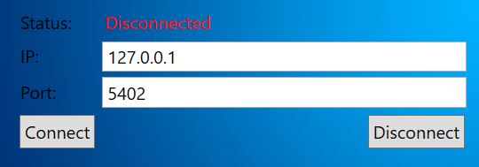
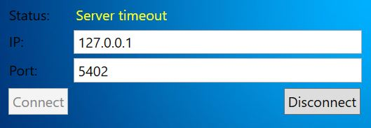
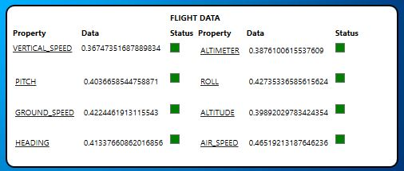
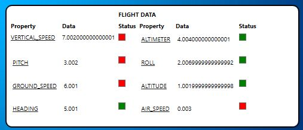
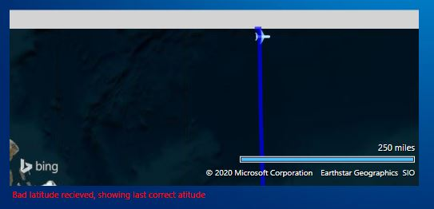

# FlightSimulatorApp
Advanced Programming 2 course, Flight Simulator App

Created by: Yair Hanimov and Eyal Golan

## Preview
A flight simulator desktop application program that interacts with a dedicated server.
We build the application using the MVVM software architectural pattern.
The program features a convenient user interface for operating a small aircraft.
The GUI contains four main components: A map components, a dashboard, a joystick and a connection section.

The user can connect to a server using the connect section, and fly the plane using the joystick. 
The plane moves on the map according to the data recieved from the server.
The dasboard data is also displayed according to the data recieved from the server. 


## Program explanation
### MVVM software architectural pattern
The program contains four main components: A map components, a dashboard, a joystick and a connection section.
Each component has it's own View - View-Model - Model:
Each components has it's own model, view-model and view. The model implements an interface, that inherits from the ```INotifyPropertyChanged``` interface.

In the dashboard, connection and map components, the models update the view-model when a property has changed, as the view-model updates the view - about changes that arrived from the server.

For example, the LatitudeError property in the dashboard's model:
```
//Property holding errors regarding the plane's latitude
public String LatitudeError
{
        get
        {
                return this.latitudeError;
        }
        set
        {
                this.latitudeError = value;
                NotifyPropertyChanged("LatitudeError");
        }
}
```
In the view-model we update the matching property and immediatly update the view:
```
model.PropertyChanged += delegate (object sender, PropertyChangedEventArgs e)
{
        NotifyPropertyChanged("Vm" + e.PropertyName);
};
...
//Property responsible for relaying latitude errors
public String VmLatitudeError
{
        get
        {
                return this.model.LatitudeError;
        }
}
```
The property is binded to the relavent field in the view.

In the Gear component, the view updates the view-model which then updates the view - about changes the user made to the joystick.

### Threads

The models of the dashboard, map and gear each open a thread in order to read and write data to and from the server.
In the gear's model we used a command queue to update the server:
```
// We maintain a queue which collects the set commands, and send them to the server in the proper order
private void StartWriting()
{
    new Thread(delegate ()
    {
        while (true)
        {
            // sending the data until we disconnected or the queue is empty 
            if (String.Equals(tc.IsConnected, "Connected") && this.writeQueue.Count != 0)
            {
                string writeCommand = writeQueue.Peek();
                writeQueue.Dequeue();
                tc.Write(writeCommand);
                tc.Read();
            }
            else if(String.Equals(tc.IsConnected, "Disconnected") && this.writeQueue.Count != 0)
            {
                writeQueue.Clear();
            }
        }
    }).Start();
}
```

### Communicating with the server
The ```MyTelnetClient``` singelton class implements the ```ITelnetClient``` interface, and is responsible for all communications made with the server. All the models contain the same instance of the class and convery communicate with the server using that instance.

## Error handling
### Server status
The application displays the different connection states:

If the application is disconnected from a server:



If there is a timeout from the server:


### Validating the data

The application validates the incoming data from the server, and show if any received data from the server is incorrect. The application will not use that data, and will show the last correct information.




The application also validates the latitude and longtitude infromation that are received from the server, and shows if wrong data was received. Simillarly, it will show the last correct information.


