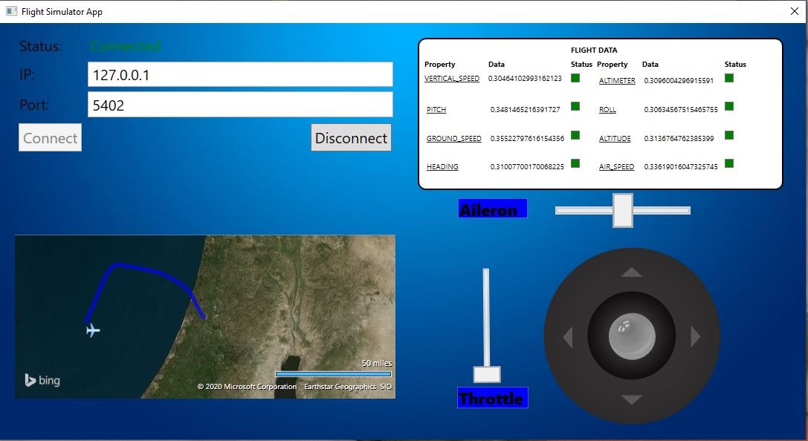

# FlightSimulatorApp
Advanced Programming 2 course, Flight Simulator App

Created by: Yair Hanimov and Eyal Golan

## Preview
A flight simulator desktop application program that interacts with a dedicated server.
We build the application using the MVVM software architectural pattern.
The program features a convenient user interface for operating a small aircraft.
The GUI contains four main components: A map components, a dashboard, a joystick and a connection section.

The user can connect to a server using the connect section, and fly the plane using the joystick. 
The plane moves on the map according to the data recieved from the server.
The dasboard data is also displayed according to the data recieved from the server. 

